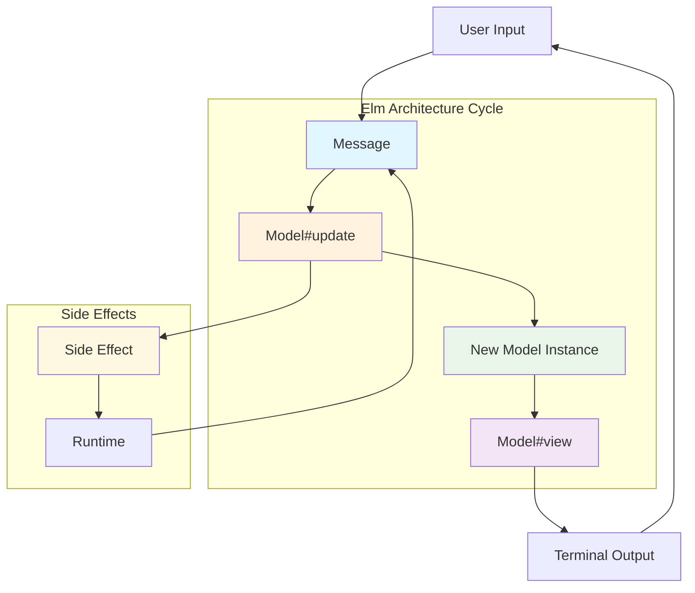
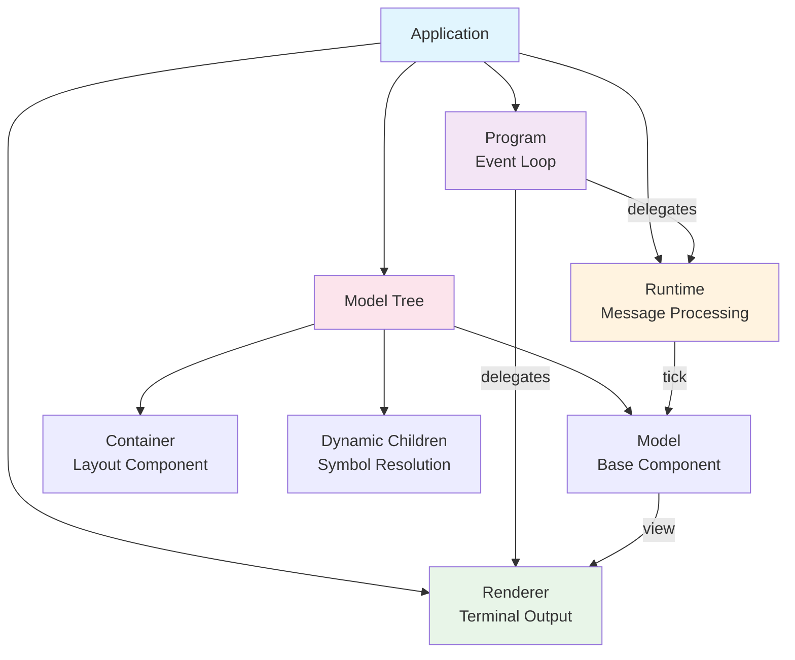
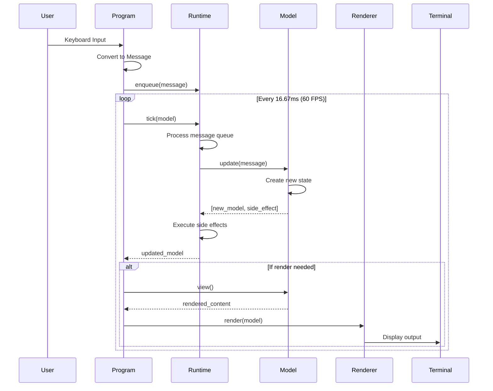
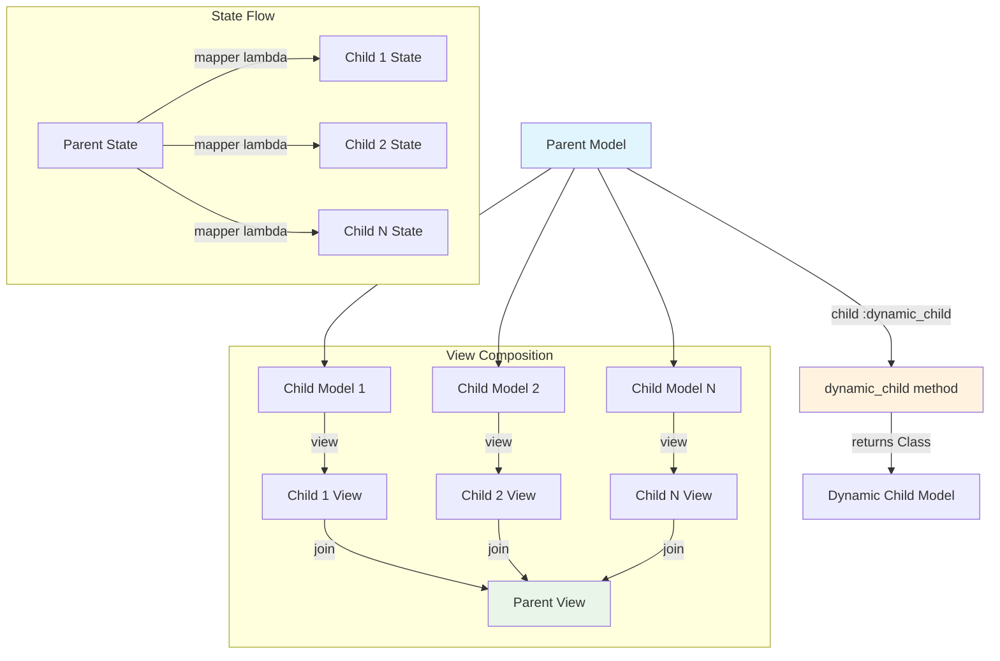
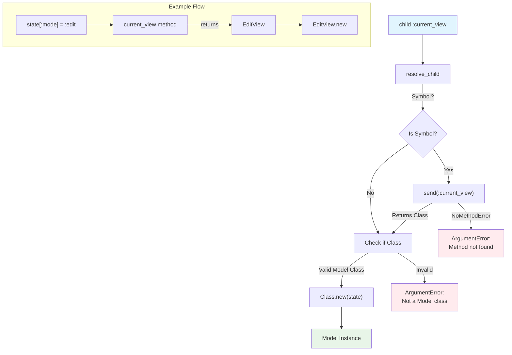
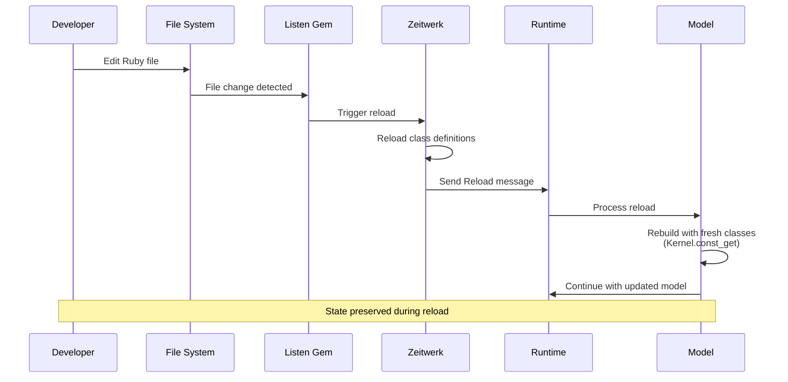

# Milktea: Terminal UI Framework Architecture

## Overview

Milktea is a Ruby Terminal User Interface (TUI) framework inspired by The Elm Architecture. It provides a functional, reactive approach to building interactive command-line applications with predictable state management and composable components.

## Core Architecture

### Elm Architecture Implementation

Milktea implements the classic Elm Architecture pattern with three core concepts:



1. **Model**: Immutable state container with view rendering and update logic
2. **Update**: Pure functions that process messages and return new state
3. **View**: Functions that render the current state to terminal output

### Component Tree



## Core Components

### Milktea Module (lib/milktea.rb)

The main module provides:
- **Zeitwerk autoloading** for automatic class loading
- **Thread-safe app registry** using mutex for concurrent access
- **Configuration management** with global config instance
- **Root path detection** for project structure awareness
- **Environment detection** (development/production)

```ruby
module Milktea
  # Thread-safe app registry
  MUTEX = Mutex.new
  
  # Global configuration
  def self.config
    MUTEX.synchronize { @config ||= Config.new }
  end
  
  # Environment detection
  def self.env
    (ENV.fetch("MILKTEA_ENV", nil) || ENV.fetch("APP_ENV", "production")).to_sym
  end
end
```

### Model Base Class (lib/milktea/model.rb)

The foundation component implementing:
- **Immutable state management** with frozen state objects
- **Child component DSL** for declarative composition
- **Dynamic child resolution** using Symbol-to-method pattern
- **State merging** with `with` method for immutable updates

```ruby
class Model
  # Child definition DSL
  def self.child(klass, mapper = nil)
    @children ||= []
    @children << { class: klass, mapper: mapper || ->(_state) { {} } }
  end
  
  # Dynamic child resolution
  def resolve_child(klass, state)
    klass = send(klass) if klass.is_a?(Symbol)
    raise ArgumentError, "Child must be a Model class" unless klass.is_a?(Class) && klass <= Model
    klass.new(state)
  rescue NoMethodError
    raise ArgumentError, "Method #{klass} not found for dynamic child resolution"
  end
end
```

### Container Layout System (lib/milktea/container.rb)

Provides CSS-like flexbox layout for terminal interfaces:
- **Flexible direction** (column/row) with proportional sizing
- **Bounds calculation** for precise positioning
- **Automatic view composition** with default `children_views` rendering
- **Flex-based space distribution** using flex ratios

```ruby
class Container < Model
  # Layout direction
  def self.direction(dir)
    @direction = dir
  end
  
  # Child with flex properties
  def self.child(klass, mapper = nil, flex: 1)
    @children ||= []
    @children << { class: klass, mapper: mapper, flex: flex }
  end
  
  # Default view shows all children
  def view = children_views
end
```

### Runtime Message Processing (lib/milktea/runtime.rb)

Manages the application's message queue and execution lifecycle:
- **Message queue processing** with thread-safe operations
- **Side effect execution** for handling special messages
- **Rendering optimization** by tracking message-based changes
- **State management** for running/stopped application states

```ruby
class Runtime
  def tick(model)
    has_render_messages = false
    
    until @queue.empty?
      message = @queue.pop(true)
      model, side_effect = model.update(message)
      execute_side_effect(side_effect)
      has_render_messages = true unless message.is_a?(Message::None)
    end
    
    @should_render = has_render_messages
    model
  end
end
```

### Program Event Loop (lib/milktea/program.rb)

The main application controller that:
- **Manages the event loop** at 60 FPS using timers
- **Handles keyboard input** with TTY-Reader integration
- **Coordinates rendering** through the renderer
- **Uses delegation pattern** for clean interface separation

```ruby
class Program
  extend Forwardable
  FPS = 60
  REFRESH_INTERVAL = 1.0 / FPS
  
  # Delegate to runtime and renderer
  delegate %i[start stop running? tick render? enqueue] => :runtime
  delegate %i[setup_screen restore_screen render] => :renderer
  
  def run
    start
    setup_screen
    render(@model)
    setup_timers
    @timers.wait while running?
  ensure
    restore_screen
  end
end
```

### Renderer Terminal Management (lib/milktea/renderer.rb)

Handles all terminal interaction:
- **Screen management** with setup/restore capabilities
- **Cursor control** using TTY-Cursor for positioning
- **Output optimization** with atomic screen updates
- **Clean rendering** with screen clearing and flushing

```ruby
class Renderer
  def render(model)
    @output.print @cursor.clear_screen
    @output.print @cursor.move_to(0, 0)
    @output.print model.view
    @output.flush
  end
end
```

### Configuration System (lib/milktea/config.rb)

Centralized configuration management:
- **Autoload directories** for Zeitwerk integration
- **Hot reloading settings** with environment-based defaults
- **Lazy initialization** of runtime and renderer instances
- **Path resolution** for autoload directories

```ruby
class Config
  def initialize
    @autoload_dirs = ["app/models"]
    @output = $stdout
    @hot_reloading = nil
    @runtime = nil
    @renderer = nil
    yield(self) if block_given?
  end
  
  def hot_reloading?
    @hot_reloading || (Milktea.env == :development)
  end
end
```

### Message System (lib/milktea/message.rb)

Immutable message definitions using Ruby's Data.define:
- **System messages** (None, Exit, Tick, Reload)
- **Input messages** (KeyPress with modifier keys)
- **Batch processing** for multiple messages
- **Type safety** with structured data objects

```ruby
module Message
  None = Data.define
  Exit = Data.define
  Tick = Data.define
  Reload = Data.define
  KeyPress = Data.define(:key, :value, :ctrl, :alt, :shift)
  Batch = Data.define(:messages)
end
```

### Loader System (lib/milktea/loader.rb)

Optional development-time features:
- **Zeitwerk integration** for automatic class loading
- **Hot reloading** with Listen gem integration
- **Multi-directory support** for complex project structures
- **Graceful degradation** when Listen gem is unavailable

```ruby
class Loader
  def setup
    @loader = Zeitwerk::Loader.new
    @autoload_paths.each { |path| @loader.push_dir(path) }
    @loader.enable_reloading
    @loader.setup
  end
  
  def hot_reload
    gem "listen"
    require "listen"
    
    @listeners = @autoload_paths.map do |path|
      Listen.to(path, only: /\.rb$/) { |modified, added, removed|
        reload if modified.any? || added.any? || removed.any?
      }
    end
    
    @listeners.each(&:start)
  rescue Gem::LoadError
    # Listen gem not available, skip file watching
  end
end
```

### Application Abstraction (lib/milktea/application.rb)

High-level interface for creating Milktea applications:
- **Auto-registration** when inherited
- **Root model definition** with DSL
- **Integrated loader setup** for development workflow
- **Simplified boot process** with error handling

```ruby
class Application
  def self.inherited(subclass)
    super
    Milktea.app = subclass
  end
  
  def self.root(model_name = nil)
    return @root_model_name if model_name.nil?
    @root_model_name = model_name
  end
  
  def self.boot
    return new.run if @root_model_name
    raise Error, "No root model defined. Use 'root \"ModelName\"' in your Application class."
  end
end
```

## Data Flow Architecture

### Message Processing Cycle



1. **Input Capture**: Program reads keyboard input via TTY-Reader
2. **Message Creation**: Input converted to structured Message objects
3. **Queue Processing**: Runtime processes message queue
4. **Model Updates**: Each message triggers model.update() calls
5. **Side Effects**: Runtime executes side effects (Exit, Batch, etc.)
6. **Rendering**: Renderer updates screen if changes occurred

### State Management

- **Immutable State**: All model state is frozen and immutable
- **Functional Updates**: State changes create new instances via `with` method
- **Hot Reload Compatibility**: Uses `Kernel.const_get` for fresh class references
- **Child State Mapping**: Parent state mapped to child state through lambdas

### Component Composition



- **Declarative DSL**: Components defined using `child` class method
- **Dynamic Resolution**: Symbol-based children resolved at runtime
- **Bounds Propagation**: Container layout automatically calculates child bounds
- **View Composition**: Parent views composed from child views

## Dynamic Child Resolution

The framework supports runtime component selection through Symbol-based definitions:



```ruby
class DynamicApp < Milktea::Model
  child :current_view  # Resolves to current_view method
  child StatusBar      # Direct class reference
  
  def current_view
    case state[:mode]
    when :edit then EditView
    when :view then DisplayView
    else DefaultView
    end
  end
end
```

### Error Handling

- **NoMethodError**: Missing methods converted to ArgumentError with clear message
- **Type Validation**: Ensures resolved classes inherit from Model
- **Debugging Support**: Clear distinction between missing methods and invalid types

## Layout System

### Flexbox-Style Layout

Containers use CSS-like flexbox for terminal interfaces:

```ruby
class Layout < Milktea::Container
  direction :row  # or :column (default)
  child Header, flex: 1
  child Content, flex: 3
  child Footer, flex: 1
end
```

### Bounds Management

```mermaid
graph TB
    Container[Container<br/>80x24 @(0,0)] --> FlexCalc[Flex Calculator]
    FlexCalc --> |flex: 1| Child1[Child 1<br/>80x4.8 @(0,0)]
    FlexCalc --> |flex: 3| Child2[Child 2<br/>80x14.4 @(0,4.8)]
    FlexCalc --> |flex: 1| Child3[Child 3<br/>80x4.8 @(0,19.2)]
    
    subgraph "Column Layout (direction: :column)"
        Container
        Child1
        Child2
        Child3
    end
    
    subgraph "Row Layout (direction: :row)"
        ContainerRow[Container<br/>80x24 @(0,0)] --> FlexCalcRow[Flex Calculator]
        FlexCalcRow --> |flex: 1| ChildR1[Child 1<br/>16x24 @(0,0)]
        FlexCalcRow --> |flex: 3| ChildR2[Child 2<br/>48x24 @(16,0)]
        FlexCalcRow --> |flex: 1| ChildR3[Child 3<br/>16x24 @(64,0)]
    end
    
    style Container fill:#e1f5fe
    style ContainerRow fill:#e1f5fe
    style FlexCalc fill:#fff3e0
    style FlexCalcRow fill:#fff3e0
```

- **Automatic Calculation**: Parent containers calculate child bounds
- **Proportional Sizing**: Flex ratios determine space distribution
- **Coordinate Propagation**: X/Y positions calculated relative to parent
- **Dynamic Compatibility**: Bounds preserved through Symbol resolution

## Development Features

### Hot Reloading



When enabled in development:
1. Listen gem watches Ruby files for changes
2. Zeitwerk reloads changed class definitions
3. Reload message sent to runtime
4. Models rebuilt with fresh classes using `Kernel.const_get`

### Configuration

```ruby
Milktea.configure do |config|
  config.autoload_dirs = ["app/models"]
  config.hot_reloading = true
  config.output = $stdout
end
```

## Performance Characteristics

### Rendering Optimization

- **Message-based rendering**: Only render on meaningful state changes
- **Atomic updates**: Screen cleared and redrawn in single operation
- **60 FPS event loop**: Consistent timing for smooth interaction
- **Non-blocking input**: Keyboard input processed without blocking

### Memory Management

- **Immutable objects**: Prevents accidental mutation
- **Structural sharing**: Ruby's copy-on-write for efficiency
- **Frozen state**: Explicit immutability enforcement
- **Minimal allocation**: Efficient object creation patterns

## Testing Architecture

The framework is designed for testability:

- **Dependency injection**: Runtime and renderer can be mocked
- **Pure functions**: View and update methods are deterministic
- **Immutable state**: Easy to test state transitions
- **Message-based**: Clear input/output for testing

## Design Principles

### Functional Programming

- **Immutable data**: All state changes create new objects
- **Pure functions**: Predictable behavior without side effects
- **Composable components**: Build complex UIs from simple parts
- **Declarative style**: Describe what you want, not how to achieve it

### Developer Experience

- **Hot reloading**: Instant feedback during development
- **Clear error messages**: Descriptive errors for debugging
- **Minimal boilerplate**: Sensible defaults reduce code
- **Consistent patterns**: Unified approach across framework

### Architecture Simplicity

- **Single responsibility**: Each component has a clear purpose
- **Loose coupling**: Components interact through well-defined interfaces
- **Dependency injection**: Easy to test and customize
- **Event-driven**: Clean separation of concerns through messages

## Current Implementation Status

This framework is actively developed with:
- **Complete Elm Architecture implementation**
- **Functional Container layout system**
- **Dynamic child resolution framework-wide**
- **Hot reloading with Zeitwerk integration**
- **Thread-safe configuration management**
- **Comprehensive test coverage**

The architecture provides a solid foundation for building maintainable, interactive terminal applications using functional programming principles while maintaining Ruby's dynamic capabilities.