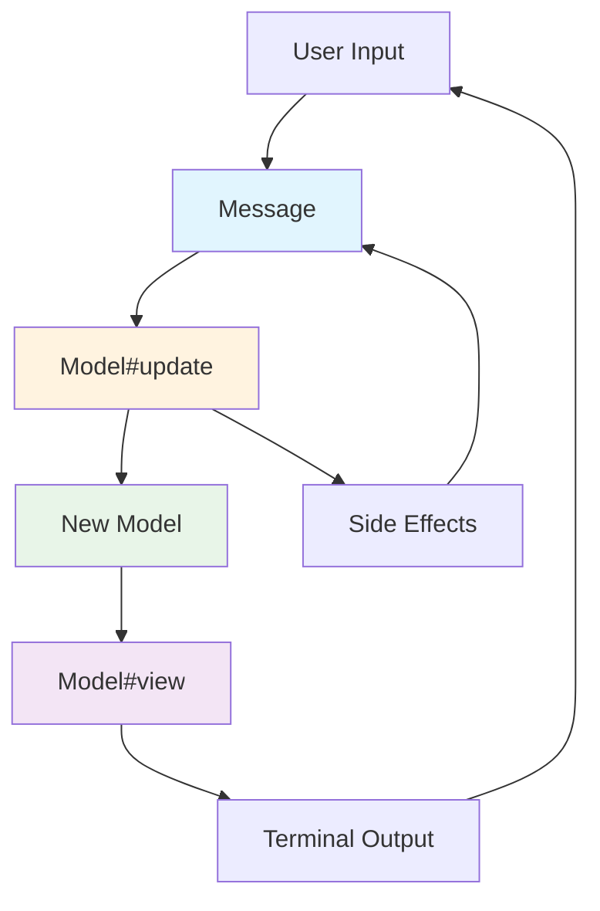
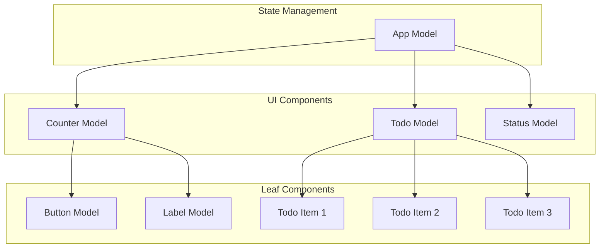
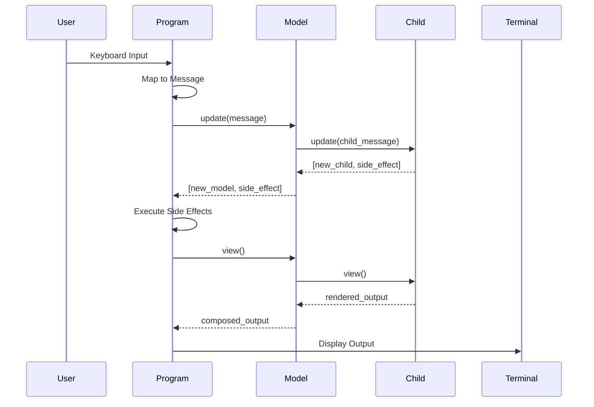
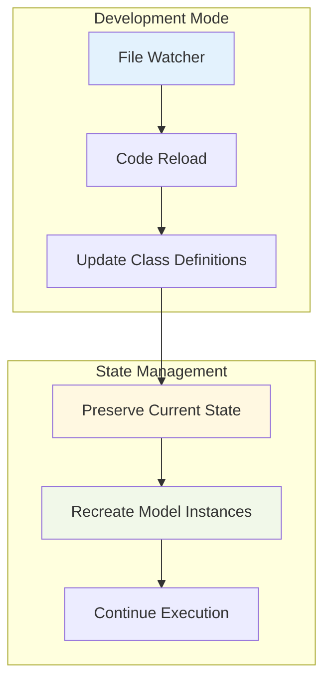
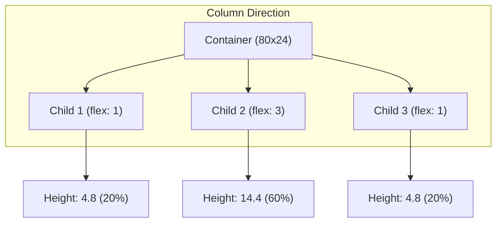
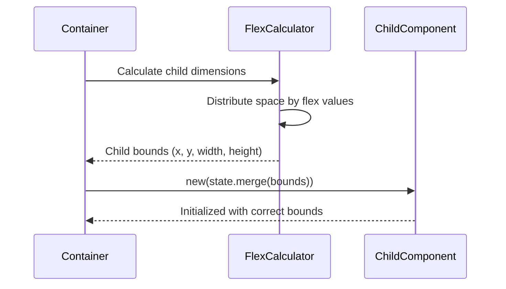

# Milktea: Elm Architecture Reactive TUI Framework

## Overview

Milktea is a Ruby Terminal User Interface (TUI) framework inspired by The Elm Architecture. It provides a functional, reactive approach to building interactive command-line applications with predictable state management and composable components.

## Core Concepts

### Terminology

- **Model**: A ViewModel that encapsulates both state and behavior for a component
- **Child Model**: Nested models declared using DSL that receive mapped state from parent
- **Message**: An event that triggers state changes, replacing traditional commands
- **Program**: The main event loop that manages keyboard input and coordinates rendering
- **Renderer**: Handles terminal screen management, clearing, and output rendering
- **Runtime**: Manages message queue processing and execution state

### Architecture Principles

1. **Unidirectional Data Flow**: Messages flow through the update cycle in a predictable manner
2. **Immutable State**: Models create new instances rather than mutating existing state
3. **Pure Functions**: View and update methods produce consistent outputs for the same inputs
4. **Composable Components**: Models can contain child models forming a tree structure
5. **Simple Child Management**: Child models are declaratively defined and automatically rebuilt on state changes

## Architecture Diagrams

### Model-Update-View Cycle



### Component Composition



### Message Flow



### Auto Reloading Mechanism



## Core Implementation

### Model Base Class with Dynamic Resolution

```ruby
module Milktea
  class Model
    attr_reader :state, :children

    class << self
      def child(klass, mapper = nil)
        @children ||= []
        @children << {
          class: klass,           # Can be Class or Symbol
          mapper: mapper || ->(_state) { {} }
        }
      end

      def children
        @children ||= []
      end
    end

    def initialize(state = {})
      @state = default_state.merge(state).freeze
      @children = build_children(@state)
    end

    def view
      raise NotImplementedError, "#{self.class} must implement #view"
    end

    def update(message)
      raise NotImplementedError, "#{self.class} must implement #update"
    end

    def with(new_state = {})
      merged_state = @state.merge(new_state)
      return Kernel.const_get(self.class.name).new(merged_state) if self.class.name
      self.class.new(merged_state)
    end

    def children_views
      @children.map(&:view).join
    end

    private

    def build_children(parent_state)
      self.class.children.map do |definition|
        state = definition[:mapper].call(parent_state)
        resolve_child(definition[:class], state)
      end.freeze
    end

    # Dynamic child resolution - Symbol to Method to Class
    def resolve_child(klass, state)
      klass = send(klass) if klass.is_a?(Symbol)
      raise ArgumentError, "Child must be a Model class, got #{klass.class}" unless klass.is_a?(Class) && klass <= Model
      klass.new(state)
    rescue NoMethodError
      raise ArgumentError, "Method #{klass} not found for dynamic child resolution"
    end

    def default_state
      {}
    end
  end
end
```

### Container Layout System

```ruby
module Milktea
  class Container < Model
    attr_reader :bounds

    class << self
      def child(klass, mapper = nil, flex: 1)
        @children ||= []
        @children << {
          class: klass,
          mapper: mapper || ->(_state) { {} },
          flex: flex
        }
      end

      def direction(dir)
        @direction = dir
      end

      def flex_direction
        @direction || :column
      end
    end

    def initialize(state = {})
      @bounds = extract_bounds(state)
      super(state.except(:width, :height, :x, :y))
    end

    def view = children_views

    private

    def build_children(parent_state)
      return [].freeze if self.class.children.empty?
      layout_children(parent_state)
    end

    def layout_children(parent_state)
      case self.class.flex_direction
      when :row
        layout_children_row(parent_state)
      else
        layout_children_column(parent_state)
      end
    end

    def layout_children_column(parent_state)
      total_flex = calculate_total_flex
      current_y = bounds.y

      self.class.children.map do |definition|
        child_height = calculate_child_height(definition[:flex], total_flex)
        child_state = build_child_state_column(definition, parent_state, current_y, child_height)
        current_y += child_height
        resolve_child(definition[:class], child_state)
      end.freeze
    end

    def layout_children_row(parent_state)
      total_flex = calculate_total_flex
      current_x = bounds.x

      self.class.children.map do |definition|
        child_width = calculate_child_width(definition[:flex], total_flex)
        child_state = build_child_state_row(definition, parent_state, current_x, child_width)
        current_x += child_width
        resolve_child(definition[:class], child_state)
      end.freeze
    end
  end
end
```

### Message System

```ruby
module Milktea
  module Message
    # System messages
    None = Data.define
    Quit = Data.define
    Tick = Data.define
    ReloadDetected = Data.define

    # Input messages
    KeyPress = Data.define(:key, :value, :ctrl, :alt, :shift)
    KeyUp = Data.define
    KeyDown = Data.define
    KeyEnter = Data.define
    KeyEscape = Data.define

    # Side effect messages
    Later = Data.define(:delay, :message)
    Batch = Data.define(:messages)

    # Component messages
    ChildMessage = Data.define(:child_index, :message)
  end
end
```

### Runtime Implementation

```ruby
module Milktea
  class Runtime
    def initialize(queue: Queue.new)
      @queue = queue
      @running = false
      @should_render = false
    end

    def tick(model)
      has_render_messages = false

      until @queue.empty?
        message = @queue.pop(true) # non-blocking pop
        model, side_effect = model.update(message)
        execute_side_effect(side_effect)

        # Only Message::None instances should not trigger render
        has_render_messages = true unless message.is_a?(Message::None)
      end

      @should_render = has_render_messages
      model
    end

    def render?
      @should_render
    end

    def stop?
      !@running
    end

    def running?
      @running
    end

    def start
      @running = true
    end

    def stop
      @running = false
    end

    def enqueue(message)
      @queue << message
    end

    private

    def execute_side_effect(side_effect)
      case side_effect
      when Message::None
        # Do nothing
      when Message::Exit
        stop
      when Message::Batch
        side_effect.messages.each { |msg| enqueue(msg) }
      end
    end
  end
end
```

### Renderer Implementation

```ruby
module Milktea
  class Renderer
    def initialize(output = $stdout)
      @output = output
      @cursor = TTY::Cursor
    end

    def setup_screen
      @output.print @cursor.clear_screen
      @output.print @cursor.move_to(0, 0)
    end

    def restore_screen
      @output.print @cursor.clear_screen
      @output.print @cursor.move_to(0, 0)
    end

    def render(model)
      @output.print @cursor.clear_screen
      @output.print @cursor.move_to(0, 0)
      @output.print model.view
      @output.flush
    end
  end
end
```

### Program Implementation

```ruby
module Milktea
  class Program
    FPS = 60
    REFRESH_INTERVAL = 1.0 / FPS

    def initialize(model, runtime: nil, renderer: nil)
      @model = model
      @runtime = runtime || Runtime.new
      @renderer = renderer || Renderer.new
      @timers = Timers::Group.new
      @reader = TTY::Reader.new(interrupt: :error)
    end

    def run
      @runtime.start
      @renderer.setup_screen
      @renderer.render(@model)
      setup_timers
      @timers.wait while running?
    ensure
      @renderer.restore_screen
    end

    def stop
      @runtime.stop
    end

    def running?
      @runtime.running?
    end

    private

    def process_messages
      read_keyboard_input
      @model = @runtime.tick(@model)
      @renderer.render(@model) if @runtime.render?
    end

    def read_keyboard_input
      key_event = @reader.read_keypress(nonblock: true)
      return unless key_event

      message = Message::KeyPress.new(
        key: key_event.name || key_event.value,
        value: key_event.value,
        ctrl: key_event.ctrl?,
        alt: key_event.alt?,
        shift: key_event.shift?
      )
      @runtime.enqueue(message)
    rescue Interrupt
      @runtime.stop
    end

    def setup_timers
      # Main event loop
      @timers.now_and_every(REFRESH_INTERVAL) do
        process_messages
      end
    end
  end
end
```

## Usage Examples

### Simple Counter

```ruby
class Counter < Milktea::Model
  private

  def default_state
    { count: 0 }
  end

  public

  def view
    TTY::Box.frame(
      "Count: #{state[:count]}\n\n" \
      "Press 'i' to increment\n" \
      "Press 'r' to reset\n" \
      "Press 'q' to quit",
      title: "Counter"
    )
  end

  def update(message)
    case message
    when Milktea::Message::KeyPress
      case message.key
      when 'i', '+'
        [with(count: state[:count] + 1), Milktea::Message::None.new]
      when 'r'
        [with(count: 0), Milktea::Message::None.new]
      when 'q'
        [self, Milktea::Message::Quit.new]
      else
        [self, Milktea::Message::None.new]
      end
    else
      [self, Milktea::Message::None.new]
    end
  end
end

# Usage
counter = Counter.new
program = Milktea::Program.new(counter)
program.run

# With dependency injection
runtime = Milktea::Runtime.new
renderer = Milktea::Renderer.new
program = Milktea::Program.new(counter, runtime: runtime, renderer: renderer)
program.run
```

### Dynamic Composite Component

```ruby
class Dashboard < Milktea::Model
  child :current_counter, ->(state) { { count: state[:count] } }
  child StatusBar, ->(state) { { message: state[:status_message] } }

  def current_counter
    state[:advanced_mode] ? AdvancedCounter : SimpleCounter
  end

  private

  def default_state
    { count: 0, status_message: "Ready", app_version: "1.0", advanced_mode: false }
  end

  public

  def view
    TTY::Box.frame(children_views, title: "Dashboard v#{state[:app_version]}")
  end

  def update(message)
    case message
    when Milktea::Message::KeyPress
      case message.key
      when 'i'
        [with(count: state[:count] + 1), Milktea::Message::None.new]
      when 'm'
        [with(advanced_mode: !state[:advanced_mode]), Milktea::Message::None.new]
      when 'r'
        [with(count: 0, status_message: "Reset!"), Milktea::Message::None.new]
      when 'q'
        [self, Milktea::Message::Quit.new]
      else
        [self, Milktea::Message::None.new]
      end
    else
      [self, Milktea::Message::None.new]
    end
  end
end
```

### Container Layout Example

```ruby
class LayoutDemo < Milktea::Container
  direction :column
  child :status_bar, flex: 1
  child :dynamic_layout, ->(state) { state.slice(:data) }, flex: 5

  def status_bar
    StatusBar
  end

  def dynamic_layout
    state[:show_column] ? ColumnLayout : RowLayout
  end

  def update(message)
    case message
    when Milktea::Message::KeyPress
      case message.key
      when 't'
        [with(show_column: !state[:show_column]), Milktea::Message::None.new]
      else
        [self, Milktea::Message::None.new]
      end
    else
      [self, Milktea::Message::None.new]
    end
  end
end
```

## Optional Loader System

### Development vs Examples

The framework provides an optional Loader system that separates development features from core functionality:

```ruby
# Examples: No loader needed (lightweight)
Milktea.configure do |config|
  config.loader = nil  # Default - no autoloading overhead
end

# Applications: Explicit loader configuration
Milktea.configure do |config|
  config.loader = Milktea::Loader.new(config.app_path, config.runtime)
  config.hot_reloading = true
end
```

### Loader Architecture

The Loader provides two distinct capabilities:

1. **Basic Autoloading**: Always available when loader is configured
   - Uses Zeitwerk for Ruby code loading
   - Enables automatic class loading from app directory
   - Provides foundation for development workflows

2. **Hot Reloading**: Conditionally enabled based on configuration
   - Requires Listen gem (optional dependency)
   - Watches for file changes and triggers reloads
   - Gracefully degrades when Listen is unavailable

### Implementation Strategy

```ruby
class Loader
  def start
    # Always setup basic autoloading
    setup_loader
  end

  def hot_reload
    # Conditionally enable file watching
    gem "listen"
    @listener = Listen.to(@app_dir, only: /\.rb$/) do |modified, added, removed|
      reload if modified.any? || added.any? || removed.any?
    end
    @listener.start
  rescue Gem::LoadError
    # Listen gem not available, skip file watching
  end

  private

  def reload
    @loader.reload
    @runtime.enqueue(Message::Reload.new)
  end
end
```

### Hot Reloading Strategy

1. **Optional Activation**: Only enabled when `config.loader` is explicitly set
2. **Detect Code Changes**: File watcher detects Ruby file modifications (when Listen available)
3. **Reload Classes**: Zeitwerk reloads the changed class definitions
4. **Message Communication**: Send `Message::Reload` to Runtime
5. **Automatic Propagation**: Runtime handles reload message without additional action needed

The key insight is that Zeitwerk handles the actual reloading automatically, so the Loader just needs to trigger the reload and notify the Runtime.

## Performance Optimization

### Rendering Optimization

1. **Message-Based Rendering**: Only re-render when non-None messages are processed
2. **Atomic Output**: Clear screen and output content in one operation to minimize flicker
3. **Batch Processing**: Process all pending messages before rendering once

### Memory Management

1. **Immutable Models**: Use structural sharing where possible
2. **Frozen State**: Prevent accidental mutations
3. **Efficient Updates**: Minimize object creation during updates

## Testing Strategy

### Unit Testing Models

```ruby
RSpec.describe Counter do
  subject(:counter) { described_class.new }

  describe '#update' do
    context 'with increment message' do
      let(:message) { Milktea::Message::KeyPress.new(key: 'i') }

      it 'increments the count' do
        new_model, _side_effect = counter.update(message)
        expect(new_model.send(:state)[:count]).to eq(1)
      end
    end
  end

  describe '#view' do
    it 'renders the current count' do
      expect(counter.view).to include('Count: 0')
    end
  end
end
```

### Integration Testing

```ruby
RSpec.describe Milktea::Program do
  let(:initial_model) { Counter.new }
  let(:output) { StringIO.new }
  let(:renderer) { Milktea::Renderer.new(output) }
  subject(:program) { described_class.new(initial_model, renderer: renderer) }

  describe '#run' do
    it 'renders initial model' do
      program.run
      expect(output.string).to include('Count: 0')
    end
  end
end
```

## Design Principles

### Simplicity First

- Minimal API surface
- Clear separation of concerns
- Predictable behavior

### Developer Experience

- Hot reloading for rapid development
- Clear error messages
- Comprehensive documentation

### Performance

- Efficient rendering pipeline
- Minimal memory allocation
- Responsive user interface

## Dynamic Child Resolution

### Symbol-Based Component Selection

The framework supports dynamic child resolution through Symbol-based definitions:

```ruby
class DynamicApp < Milktea::Model
  child :current_view  # Symbol resolves to method
  child StatusBar      # Traditional class reference

  def current_view
    case state[:mode]
    when :editing then EditView
    when :viewing then DisplayView
    else DefaultView
    end
  end
end
```

### Container Dynamic Layouts

Containers can switch layout types while preserving bounds:

```ruby
class LayoutDemo < Milktea::Container
  direction :column
  child :status_bar, flex: 1
  child :dynamic_layout, ->(state) { state.slice(:data) }, flex: 5

  def dynamic_layout
    state[:show_column] ? ColumnLayout : RowLayout
  end
end
```

### Error Handling Strategy

1. **NoMethodError**: Caught and converted to descriptive ArgumentError
2. **Type Validation**: Ensures resolved classes inherit from Model
3. **Clear Messages**: Distinguishes between missing methods and invalid types

## Layout System Architecture

### Flexbox-Style Proportional Sizing



### Bounds Propagation



## Future Development

### Planned Features

1. **Advanced Widgets**: Input fields, tables, trees, and menus

### Community

- Clear contribution guidelines
- Comprehensive examples
- Active maintenance and support

## Conclusion

Milktea provides a solid foundation for building interactive terminal applications using functional programming principles. The framework's simplicity, combined with powerful features like auto-reloading and composable components, makes it an excellent choice for Ruby developers building CLI tools and TUI applications.

The architecture ensures predictable behavior, easy testing, and maintainable code while providing the flexibility needed for complex terminal interfaces.
