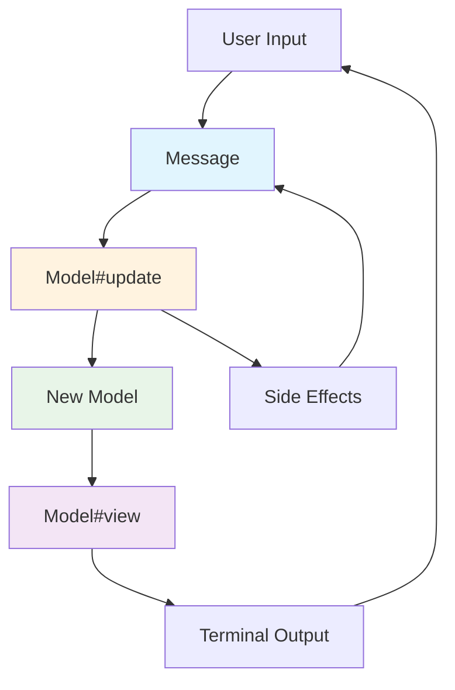
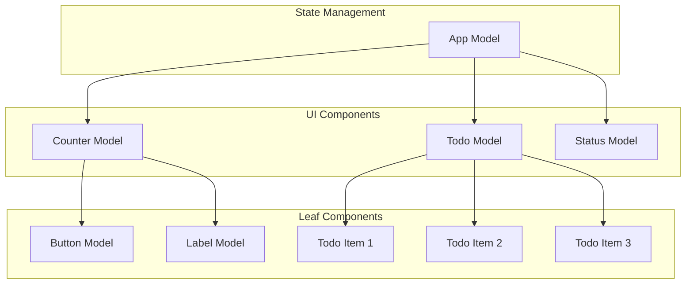
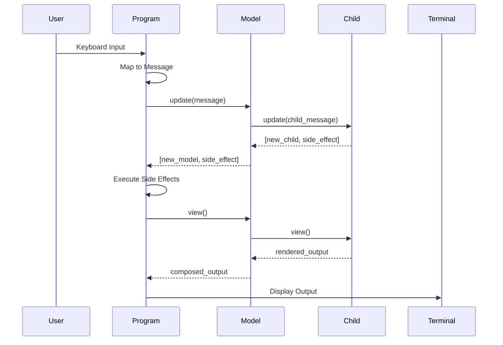
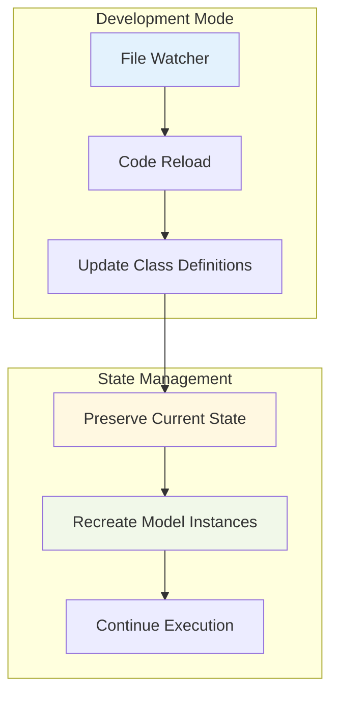

# Milktea: Elm Architecture Reactive TUI Framework

## Overview

Milktea is a Ruby Terminal User Interface (TUI) framework inspired by The Elm Architecture. It provides a functional, reactive approach to building interactive command-line applications with predictable state management and composable components.

## Core Concepts

### Terminology

- **Model**: A ViewModel that encapsulates both state and behavior for a component
- **Child Model**: Nested models declared using DSL that receive mapped state from parent
- **Message**: An event that triggers state changes, replacing traditional commands
- **Program**: The main event loop that manages keyboard input and coordinates rendering
- **Renderer**: Handles terminal screen management, clearing, and output rendering
- **Runtime**: Manages message queue processing and execution state

### Architecture Principles

1. **Unidirectional Data Flow**: Messages flow through the update cycle in a predictable manner
2. **Immutable State**: Models create new instances rather than mutating existing state
3. **Pure Functions**: View and update methods produce consistent outputs for the same inputs
4. **Composable Components**: Models can contain child models forming a tree structure
5. **Simple Child Management**: Child models are declaratively defined and automatically rebuilt on state changes

## Architecture Diagrams

### Model-Update-View Cycle



### Component Composition



### Message Flow



### Auto Reloading Mechanism



## Core Implementation

### Model Base Class

```ruby
module Milktea
  class Model
    attr_reader :state, :children
    
    class << self
      def child(child_class, state_mapper = nil)
        @child_definitions ||= []
        @child_definitions << {
          class: child_class,
          state_mapper: state_mapper || ->(state) { {} }
        }
      end
      
      def child_definitions
        @child_definitions ||= []
      end
    end
    
    def initialize(state = {})
      @state = default_state.merge(state).freeze
      @children = build_children(@state)
    end
    
    def view
      raise NotImplementedError, "#{self.class} must implement #view"
    end
    
    def update(message)
      raise NotImplementedError, "#{self.class} must implement #update"
    end
    
    def with(new_state = {})
      merged_state = @state.merge(new_state)
      self.class.new(merged_state)
    end
    
    def children_views
      @children.map(&:view).join("\n")
    end
    
    private
    
    def build_children(parent_state)
      self.class.child_definitions.map do |definition|
        child_class = definition[:class]
        child_state = definition[:state_mapper].call(parent_state)
        child_class.new(child_state)
      end.freeze
    end
    
    def default_state
      {}
    end
  end
end
```

### Message System

```ruby
module Milktea
  module Message
    # System messages
    None = Data.define
    Quit = Data.define
    Tick = Data.define
    ReloadDetected = Data.define
    
    # Input messages
    KeyPress = Data.define(:key, :value, :ctrl, :alt, :shift)
    KeyUp = Data.define
    KeyDown = Data.define
    KeyEnter = Data.define
    KeyEscape = Data.define
    
    # Side effect messages
    Later = Data.define(:delay, :message)
    Batch = Data.define(:messages)
    
    # Component messages
    ChildMessage = Data.define(:child_index, :message)
  end
end
```

### Runtime Implementation

```ruby
module Milktea
  class Runtime
    def initialize(queue: Queue.new)
      @queue = queue
      @running = false
      @should_render = false
    end

    def tick(model)
      has_render_messages = false

      until @queue.empty?
        message = @queue.pop(true) # non-blocking pop
        model, side_effect = model.update(message)
        execute_side_effect(side_effect)

        # Only Message::None instances should not trigger render
        has_render_messages = true unless message.is_a?(Message::None)
      end

      @should_render = has_render_messages
      model
    end

    def render?
      @should_render
    end

    def stop?
      !@running
    end

    def running?
      @running
    end

    def start
      @running = true
    end

    def stop
      @running = false
    end

    def enqueue(message)
      @queue << message
    end

    private

    def execute_side_effect(side_effect)
      case side_effect
      when Message::None
        # Do nothing
      when Message::Exit
        stop
      when Message::Batch
        side_effect.messages.each { |msg| enqueue(msg) }
      end
    end
  end
end
```

### Renderer Implementation

```ruby
module Milktea
  class Renderer
    def initialize(output = $stdout)
      @output = output
      @cursor = TTY::Cursor
    end

    def setup_screen
      @output.print @cursor.clear_screen
      @output.print @cursor.move_to(0, 0)
    end

    def restore_screen
      @output.print @cursor.clear_screen
      @output.print @cursor.move_to(0, 0)
    end

    def render(model)
      @output.print @cursor.clear_screen
      @output.print @cursor.move_to(0, 0)
      @output.print model.view
      @output.flush
    end
  end
end
```

### Program Implementation

```ruby
module Milktea
  class Program
    FPS = 60
    REFRESH_INTERVAL = 1.0 / FPS
    
    def initialize(model, runtime: nil, renderer: nil)
      @model = model
      @runtime = runtime || Runtime.new
      @renderer = renderer || Renderer.new
      @timers = Timers::Group.new
      @reader = TTY::Reader.new(interrupt: :error)
    end
    
    def run
      @runtime.start
      @renderer.setup_screen
      @renderer.render(@model)
      setup_timers
      @timers.wait while running?
    ensure
      @renderer.restore_screen
    end
    
    def stop
      @runtime.stop
    end

    def running?
      @runtime.running?
    end
    
    private
    
    def process_messages
      read_keyboard_input
      @model = @runtime.tick(@model)
      @renderer.render(@model) if @runtime.render?
    end

    def read_keyboard_input
      key_event = @reader.read_keypress(nonblock: true)
      return unless key_event

      message = Message::KeyPress.new(
        key: key_event.name || key_event.value,
        value: key_event.value,
        ctrl: key_event.ctrl?,
        alt: key_event.alt?,
        shift: key_event.shift?
      )
      @runtime.enqueue(message)
    rescue Interrupt
      @runtime.stop
    end

    def setup_timers
      # Main event loop
      @timers.now_and_every(REFRESH_INTERVAL) do
        process_messages
      end
    end
  end
end
```

## Usage Examples

### Simple Counter

```ruby
class Counter < Milktea::Model
  private
  
  def default_state
    { count: 0 }
  end
  
  public
  
  def view
    TTY::Box.frame(
      "Count: #{state[:count]}\n\n" \
      "Press 'i' to increment\n" \
      "Press 'r' to reset\n" \
      "Press 'q' to quit",
      title: "Counter"
    )
  end
  
  def update(message)
    case message
    when Milktea::Message::KeyPress
      case message.key
      when 'i', '+'
        [with(count: state[:count] + 1), Milktea::Message::None.new]
      when 'r'
        [with(count: 0), Milktea::Message::None.new]
      when 'q'
        [self, Milktea::Message::Quit.new]
      else
        [self, Milktea::Message::None.new]
      end
    else
      [self, Milktea::Message::None.new]
    end
  end
end

# Usage
counter = Counter.new
program = Milktea::Program.new(counter)
program.run

# With dependency injection
runtime = Milktea::Runtime.new
renderer = Milktea::Renderer.new
program = Milktea::Program.new(counter, runtime: runtime, renderer: renderer)
program.run
```

### Composite Component

```ruby
class Dashboard < Milktea::Model
  class << self
    child Counter, ->(state) { { count: state[:count] } }
    child StatusBar, ->(state) { { message: state[:status_message] } }
  end
  
  private
  
  def default_state
    { count: 0, status_message: "Ready", app_version: "1.0" }
  end
  
  public
  
  def view
    TTY::Box.frame(children_views, title: "Dashboard v#{state[:app_version]}")
  end
  
  def update(message)
    case message
    when Milktea::Message::KeyPress
      case message.key
      when 'i'
        [with(count: state[:count] + 1), Milktea::Message::None.new]
      when 'r'
        [with(count: 0, status_message: "Reset!"), Milktea::Message::None.new]
      when 'q'
        [self, Milktea::Message::Quit.new]
      else
        [self, Milktea::Message::None.new]
      end
    else
      [self, Milktea::Message::None.new]
    end
  end
end
```

## Auto Reloading Support

### Development Mode

The framework supports automatic code reloading during development:

```ruby
class Program
  def handle_hot_reload
    # Simple approach: let Root Model rebuild itself and all children
    # This automatically uses the updated class definitions
    @model = @model.with({})
    @runtime.enqueue(Message::ReloadDetected.new)
  end
end
```

### Hot Reloading Strategy

1. **Detect Code Changes**: File watcher detects Ruby file modifications
2. **Reload Classes**: Zeitwerk reloads the changed class definitions
3. **Rebuild Model Tree**: Call `@model.with({})` on the root model
4. **Automatic Propagation**: All child models are automatically rebuilt with fresh classes
5. **Continue Execution**: Resume normal operation with updated models

The key insight is that since children are always rebuilt when `with` is called, Hot Reloading becomes trivial - just trigger a rebuild of the root model.

## Performance Optimization

### Rendering Optimization

1. **Message-Based Rendering**: Only re-render when non-None messages are processed
2. **Atomic Output**: Clear screen and output content in one operation to minimize flicker
3. **Batch Processing**: Process all pending messages before rendering once

### Memory Management

1. **Immutable Models**: Use structural sharing where possible
2. **Frozen State**: Prevent accidental mutations
3. **Efficient Updates**: Minimize object creation during updates

## Testing Strategy

### Unit Testing Models

```ruby
RSpec.describe Counter do
  subject(:counter) { described_class.new }
  
  describe '#update' do
    context 'with increment message' do
      let(:message) { Milktea::Message::KeyPress.new(key: 'i') }
      
      it 'increments the count' do
        new_model, _side_effect = counter.update(message)
        expect(new_model.send(:state)[:count]).to eq(1)
      end
    end
  end
  
  describe '#view' do
    it 'renders the current count' do
      expect(counter.view).to include('Count: 0')
    end
  end
end
```

### Integration Testing

```ruby
RSpec.describe Milktea::Program do
  let(:initial_model) { Counter.new }
  let(:output) { StringIO.new }
  let(:renderer) { Milktea::Renderer.new(output) }
  subject(:program) { described_class.new(initial_model, renderer: renderer) }
  
  describe '#run' do
    it 'renders initial model' do
      program.run
      expect(output.string).to include('Count: 0')
    end
  end
end
```

## Design Principles

### Simplicity First

- Minimal API surface
- Clear separation of concerns
- Predictable behavior

### Developer Experience

- Hot reloading for rapid development
- Clear error messages
- Comprehensive documentation

### Performance

- Efficient rendering pipeline
- Minimal memory allocation
- Responsive user interface

## Future Development

### Planned Features

1. **Advanced Layout System**: Flexbox-like layout for complex UIs
2. **Animation Support**: Smooth transitions and effects
3. **Plugin Architecture**: Extensible middleware system
4. **Dev Tools**: Time travel debugging and performance profiling

### Community

- Clear contribution guidelines
- Comprehensive examples
- Active maintenance and support

## Conclusion

Milktea provides a solid foundation for building interactive terminal applications using functional programming principles. The framework's simplicity, combined with powerful features like auto-reloading and composable components, makes it an excellent choice for Ruby developers building CLI tools and TUI applications.

The architecture ensures predictable behavior, easy testing, and maintainable code while providing the flexibility needed for complex terminal interfaces.